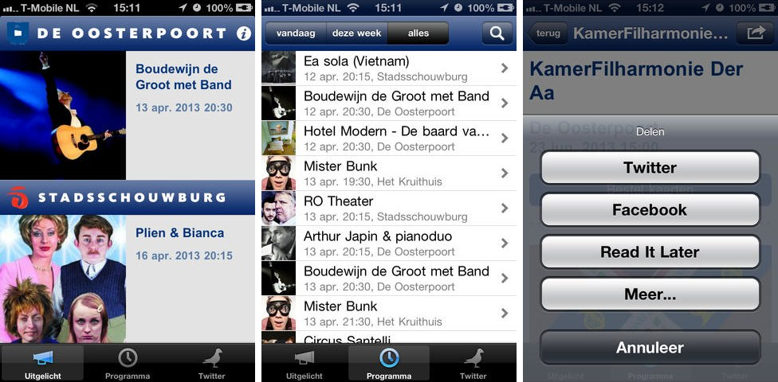
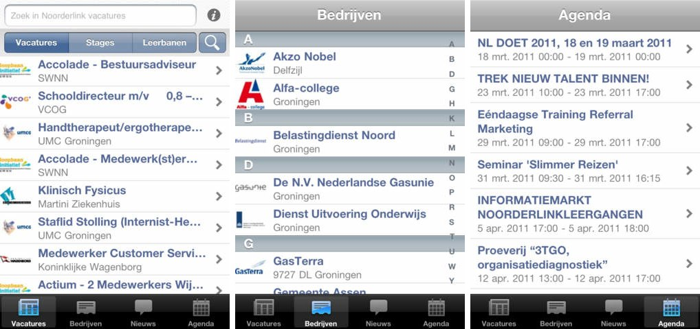
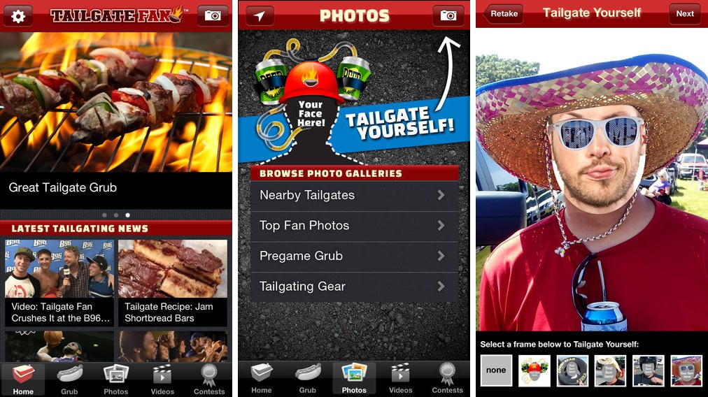
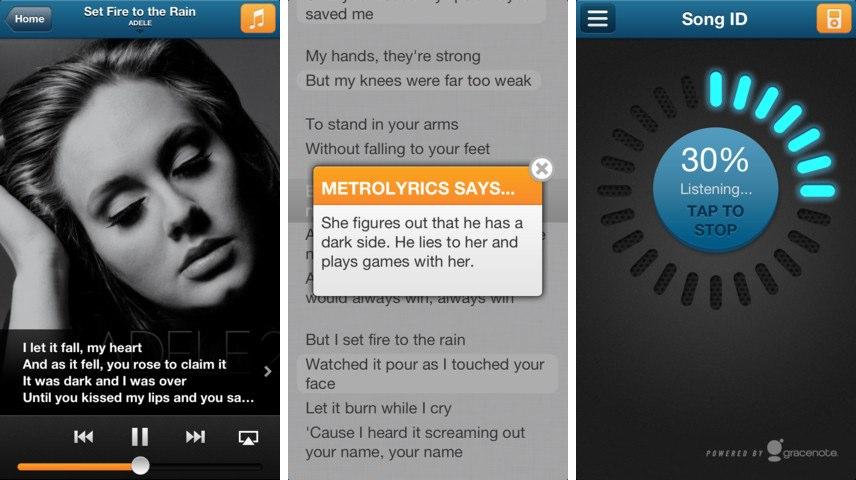
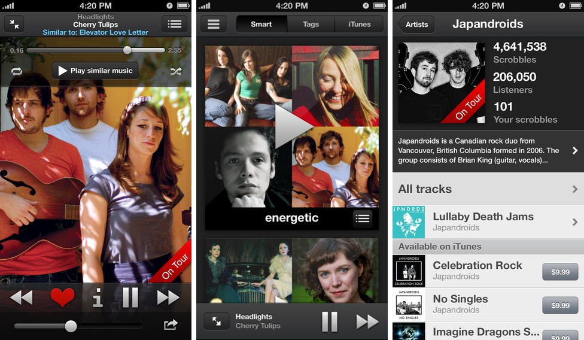
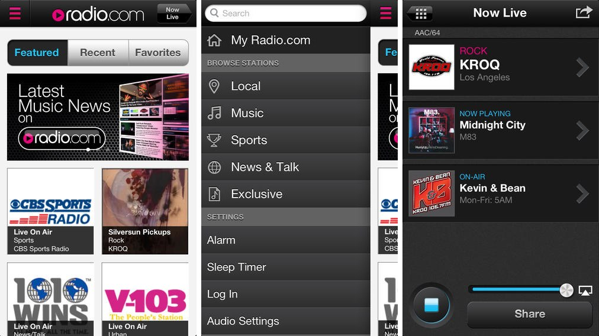
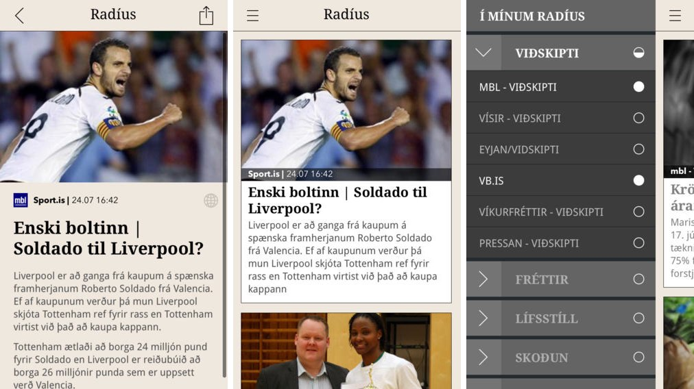

# Apps
- menu: Apps
---------------------

iOS apps I've worked on. I was either the only developer on the project, or the lead developer with more people on the team.

## Agenda Oosterpoort Stadsschouwburg Groningen

My first iOS app, created in 2010. At first I wanted to use Appcelerator Titanium because I didn't know any Objective-c, but quickly [changed my mind](/articles/2010/04/21/getting-started-iphone-app-development/) and learned the proper skills instead. I actually rewrote the entire app after I submitted the "Agenda Groninger Forum" app, because I learned so much in such a short time and wasn't happy with my first effort anymore - the curse of every good developer.

This app shows the program for a local theater and its Twitter feed. It's available for iPhone and iPad (universal build).  
[App Store (free)](https://itunes.apple.com/nl/app/agenda-oosterpoort-stadsschouwburg/id380925903?l=en&mt=8)

## Agenda Groninger Forum

View the program and Twitter feed for a local institute. Available as an universal build. Looking back, the iPad version was a poor effort, simply a bigger version of the iPhone app. It was my first universal app though, and I do like the dark design. After I submitted this app, I rewrote the "Agenda Oosterpoort" app to be universal as well.  
[App Store (free)](https://itunes.apple.com/nl/app/agenda-groninger-forum/id392906111?l=en&mt=8)

## Noorderlink

After I created two iOS app using native development tools and Objective-c, I decided to give Appcelerator Titanium another try, mainly because the client wanted an Android app as well. At first [everything was going well](/articles/2010/11/09/once-again-i-turn-appcelerator/), but in the end we got two mediocre apps and decided to start from scratch, using native SDK's for both iOS and Android. I'm glad that we did.

This app is for finding jobs in the north of The Netherlands.  
[App Store (free)](https://itunes.apple.com/nl/app/noorderlink-vacatures-noord/id408836712?l=en&mt=8)

## Radio.com v2

My first major app, built early 2012 in Iceland for CBS IMG. Listen to over 400 streaming radio stations, view artists biographies, pictures, song lyrics, news headlines and more. I'm still very proud of this app, I especially like the sliding menu on the bottom. It has a couple of million users in the United States.  
[App Store (free)](http://itunes.apple.com/us/app/radio-com-for-iphone/id323701765?mt=8)

## Tailgate Fan

"Football season is here and that can only mean one thing...time to tailgate! And with the new Tailgate Fan app, everything you need to make your tailgate great is right at your foam-fingertips." Created for CBS Local, iPhone only.  
[App Store (free)](http://itunes.apple.com/us/app/tailgate-fan-mobile-companion/id462599724?mt=8)

## MetroLyrics

A lyrics app for one of the largest lyrics websites on the planet. View the lyrics of your currently playing song (optionally auto-scrolling, karaoke-style), artist bio and pictures, song meanings and more. Built for CBS Interactive, iPhone only.  
[App Store (free)](https://itunes.apple.com/app/metrolyrics/id547825550)

## Scrobbler for iOS

"A new iOS music player that helps you rediscover the music you own. The Scrobbler is a fully-featured music player that helps you discover connections between the tracks in your iTunes library through playlists, deep artist information, and more. Plus, it scrobbles!". Created for Last.fm as an universal build. I am very proud of this app and use it myself as a replacement for the native music app on my iPhone and iPad.      
[App Store (free)](https://itunes.apple.com/app/scrobbler-for-ios/id585235199?Is=1&mt=8)

## Radio.com v3

A complete rebuild of the Radio.com streaming radio app, using a new reusable audio library for radio playback (which will be used in other CBS Local apps as well), a new interface and available as an universal app for both iPhone and iPad.  
[App Store (free)](https://itunes.apple.com/app/radio-com-for-iphone/id323701765)

## Radíus

Icelandic news reader. Choose from over a hundred Icelandic news sources and entertainment websites to create your own personalised news stream. Beautiful detail pages with support for videos and photo galleries.  
[App Store (free)](https://itunes.apple.com/app/radius/id677152055)