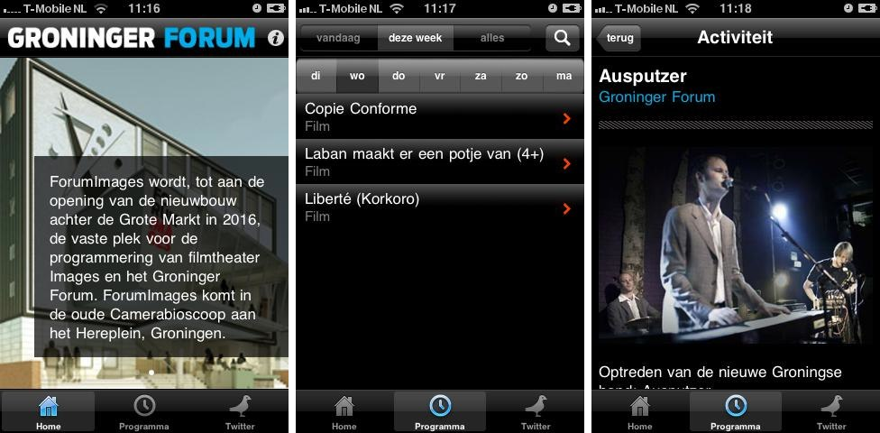

# Apps
- menu: Apps
---------------------

iOS apps I've worked on. I was either the only developer on the project, or the lead developer with more people on the team.

## Agenda Oosterpoort Stadsschouwburg Groningen

My first iOS app, created in 2010. It shows the program for a local theater and its Twitter feed. It's available for iPhone and iPad (universal build).  
[App Store (free)](https://itunes.apple.com/nl/app/agenda-oosterpoort-stadsschouwburg/id380925903?l=en&mt=8)

## Agenda Groninger Forum

View the program and Twitter feed for a local institute. Available as an universal build.  
[App Store (free)](https://itunes.apple.com/nl/app/agenda-groninger-forum/id392906111?l=en&mt=8)

## Noorderlink

Find jobs in the north of The Netherlands with this iPhone app.  
[App Store (free)](https://itunes.apple.com/nl/app/noorderlink-vacatures-noord/id408836712?l=en&mt=8)

## Radio.com v2

My first major app, build in Iceland for CBS IMG. Listen to over 400 streaming radio stations. I'm still very proud of this app, I especially like the sliding menu on the bottom. It has millions of users in the United States. iPhone only.  
[App Store (free)](http://itunes.apple.com/us/app/radio-com-for-iphone/id323701765?mt=8)

## Tailgate Fan

"Football season is here and that can only mean one thing...time to tailgate! And with the new Tailgate Fan app, everything you need to make your tailgate great is right at your foam-fingertips." Created for CBS Local, iPhone only.  
[App Store (free)](http://itunes.apple.com/us/app/tailgate-fan-mobile-companion/id462599724?mt=8)

## MetroLyrics

A lyrics app for one of the largest lyrics websites on the planet. View the lyrics of your currently playing song, artist bio and pictures, song meanings and more. Built for CBS Interactive, iPhone only.  
[App Store (free)](https://itunes.apple.com/app/metrolyrics/id547825550)

## Scrobbler for iOS

"A new iOS music player that helps you rediscover the music you own. The Scrobbler is a fully-featured music player that helps you discover connections between the tracks in your iTunes library through playlists, deep artist information, and more. Plus, it scrobbles!". Created for Last.fm as an universal build.    
[App Store (free)](https://itunes.apple.com/app/scrobbler-for-ios/id585235199?Is=1&mt=8)

## Radio.com v3
A new version of the Radio.com app is coming soon.