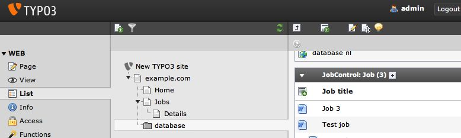
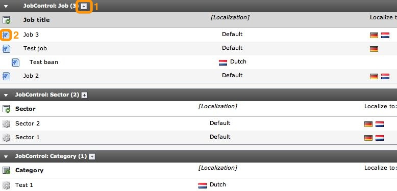
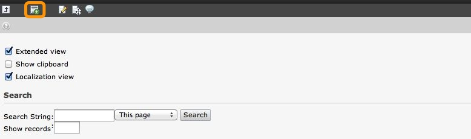
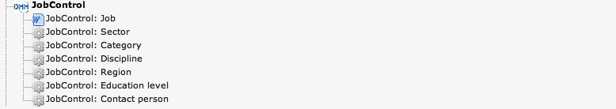
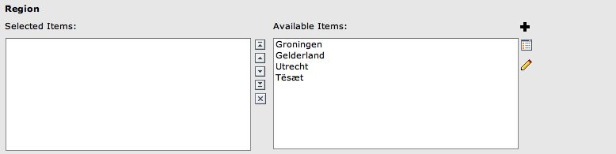
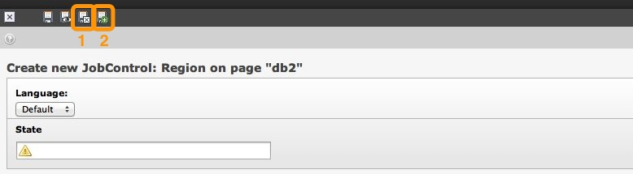

# Users manual
- template: jobcontrol.html
- submenu: users
---------------------

# Users manual
This section is meant for editors who will be adding jobs to the site. For information about setting up the extension and the pages needed, please refer to the [Administration chapter](admins).

To add, edit and delete job you should be working in the **List module**, as shown on this screenshot:

Navigate to the page that contains your jobs-database, and if your website already contains some jobs, you should be seeing something like this:

To add a job to your site, simply click button **1**. You will then go to the form to add a new job. If you wish to edit a job, click the job icon (**2**).

If you have not yet added any jobs to your site, you will see a screen like this:

Click on the "Create new record" button to go to the next screen, where you can choose the type of record you wish to create.

Click on the link "JobControl: Job" to go to the form to add a new job.

## Adding a new job, relation fields explained
Once you have gone to the form to add a new job, you will see a lot of fields that you can just fill in with text. However, there are also a number of "relation" fields, that look like this:

These types of fields can be used to select multiple items. Simply click on an item on the right side to select it. It will then be added to the left side. Repeat this step to add multiple items to your job. You can also add new items so they can be used in this (and other) jobs. Simply click on the big plus icon on the right side to go to the form to add a new item. In the example below we will add a new region:

Enter the required field and click on either button **1** to save the region and add yet another one, or click on button **2** to save the new region and go back to the job.
When you have entered all the information for the job you can then save the form by clicking on the save button on the bottom of the form. You will be redirected to the list-view of all jobs, with the job you've just added on top of the list.
